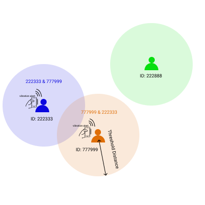
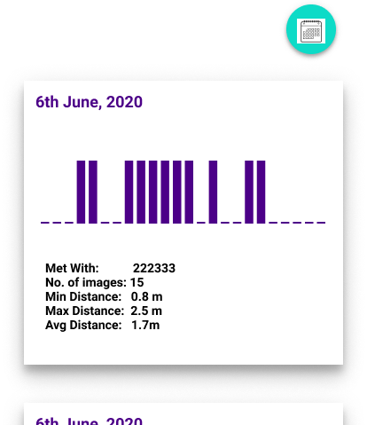
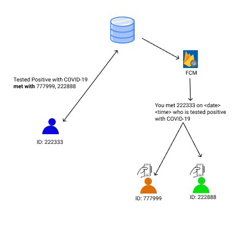

## Contact Tracing Mobile Application

#### This application will serve 3 purposes
- It will notify users as soon as they come into contact where the center-to-center distance id <= `Threshold distance` (ex: 6 feet)
- The device will keep track of `ID`s with whom the user will come into contact in a local database. User can check the history of a perticular day from the application.
- If someone is detected positive with Corona Virus, she/he will notify server and server will in turn notify those users who came into contact with that infected person in last `15 days`

#### Technology Used:
[Android Beacon Library](https://altbeacon.github.io/android-beacon-library/index.html) will be used to make the Android devices `BLE` trasmitter and receiver.

#### OS supported:
- Android

#### How does it work:
- **STEP 1** When the user will launch the app, user will be prompted with authentication pahe. User needs to put MSIL `Staff ID` and `Password`. It will be varified againest MSIL `User Authentication` APIS.
- **STEP 2** After user is authenticated, app will communicate to a central server. It will ask for a `UUID`. Server will create an unique `UUID` and will assign it with that `staff ID`.

- **STEP 3** Now that user have `Staff ID` and `UUID`, she/he will start Bluettoth Low Energy transmission.

    When the app will be launched, it will transmit a particulat type of beacon (ex: `Altbeacon`). Since each employee has a unique 6 digit `Staff ID`, we can transmit as follows
    ```
    major: first 3 digits
    minor: last 3 digits
    ````

- **STEP 4** when muluple user will come into range, those pairs who are having center-to-center distance <= `Threshold distance` (ex: 6 feet) will store that value in local database (ex: SQLite)

    For each user, each day app will store one image to minimize the data stored in device. The general format is as follows
    | contacted_with | date | min_dustance | max_distance | avg_distance | time_pattern | total_images |
    | :---: | :---: | :---: | :---: | :---: | :---: | :---: |
    | 222333 | 08-06-2020 | 0.6 | 2.8 | 1.5 | 000000000101100000000000 | 22 |
    | 222333 | 07-06-2020 | 0.9 | 3.5 | 2.7 | 000000000111100000000000 | 15 |

    ```
    contacted_with: staff ID with whom contacted
    date: date of that particular day
    min_distance: minimum center-to-center distance
    max_distance: maximum center-to-center distance
    avg_distance: average center to center distance
    time_pattern: 24 character string signifying contact window

        character 1 : 12 AM - 01 AM
        character 2 : 01 AM - 02 AM
        character 3 : 02 AM - 03 AM
        ..
        character 11 : 10 AM - 11 AM
        character 12 : 11 AM - 12 PM
        ...
        character 24 : 11 PM - 12 AM
    ```
    
        
- **STEP 5** If any user breaches the distance rule she/he will get alert

- **STEP 6** User can also view daily stat of contact

    

- **STEP 7** If user is detected positive with COVID-19, she/he will transmit the stored `pairs` of last `15 days` to central database like the below format
    ```
    {
        vector: 222333
        contacted:[
            {
                staffID: 777999,
                latest_contact_date: 07-06-2020,
                freq_of_contact_last_15_days: 20,
                min_dis: 0.8,
                max_dis: 3.7,
                avg_dis: 2.5
            },
            {
                staffID: 222888,
                latest_contact_date: 02-06-2020,
                freq_of_contact_last_15_days: 15,
                min_dis: 1.2,
                max_dis: 3.3,
                avg_dis: 1.8
            }
        ]
    }
    ```
    Server will extract the pairs (ex: 777999, 222888) and notify those using users using FCM (Firebase Cloud Messagin Service). All this is done for minimum drain of device battery.

    

#### Roadmap:
[ ] Add User Authentication Functionality<br>
[ ] Add server side UUID generation and mapping logic<br>
[ ] Add Foreground Beacon TX & RX functionality<br>
[ ] Add vibration notification<br>
[ ] Add SQLite database and structure data<br>
[ ] Add reporting logic<br>
[ ] Add FCM service

<br>
<br>
<br>

---
©sarkarprobhakar 2020
